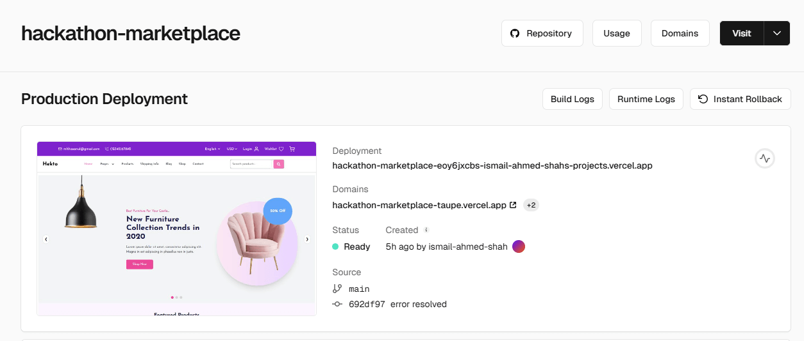
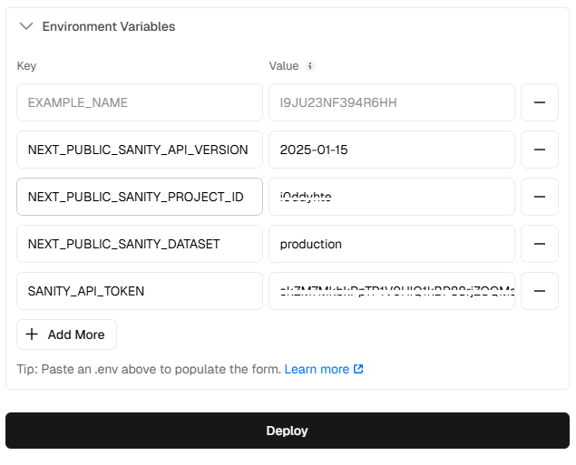

# Day 06 - Deployment Preparation and Staging Environment Setup

## Objective
On Day 6, I focused on preparing my marketplace for deployment by setting up a staging environment, configuring hosting platforms, and ensuring it is ready for a customer-facing application. Building on the testing and optimization work from Day 5, this stage emphasized ensuring that my marketplace operates seamlessly in a production-like environment. I also learned about industry-standard practices for managing different environments like non-production (TRN, DEV, SIT) and production (UAT, PROD, DR).

## Key Learning Outcomes

1. **Staging Environment Setup**:
   - Selected Vercel as the hosting platform.
   - Connected the GitHub repository to Vercel for automated deployments.
   - Configured build and deployment settings to ensure successful staging builds.
   - Set up environment variables securely within the hosting platform.
   - Validated the application functionality in a production-like environment to identify and resolve any pre-deployment issues.

2. **Professional Environment Management**:
   - Gained an understanding of various environment types: TRN, DEV, SIT, UAT, PROD, and DR.

3. **Testing and Documentation**:
   - Conducted staging environment testing and documented the results.
   - Created professional deployment documentation, including performance and test case reports.
   - Organized all project files and documents in this current GitHub repository.

## Professional Environment Types

1. **TRN (Training)**: Used for onboarding and practice.
2. **DEV (Development)**: The environment for writing and testing code locally.
3. **SIT (System Integration Testing)**: Validates integrations between systems.
4. **UAT (User Acceptance Testing)**: Allows stakeholders to test functionality and validate requirements.
5. **PROD (Production)**: The live, customer-facing environment.
6. **DR (Disaster Recovery)**: A backup environment for critical situations.


## Steps for Implementation

### Step 1: Hosting Platform Setup
#. **Selected Vercel:**:
   - Chose Vercel for its seamless integration with Next.js and GitHub.
   - Connected the GitHub repository to Vercel for automated deployments.
   - Configured build settings and added necessary scripts for deployment.
    

### Step 2: Configure Environment Variables
1. **Create a `.env` File**:
   - Included sensitive variables like API keys and tokens.
     ```plaintext
     NEXT_PUBLIC_SANITY_PROJECT_ID=your_project_id
     NEXT_PUBLIC_SANITY_DATASET=production
     API_KEY=your_api_key
     ```

2. **Upload Variables to Hosting Platform**:
   - Used the hosting platform’s dashboard to securely add environment variables.
    

### Step 3: Deploy to Staging
1. **Deploy Application**:
   - Deployed my application to a staging environment through the hosting platform.

2. **Validate Deployment**:
   - Ensured the build process completed without errors.
   - Verified basic functionality in the staging environment.

### Step 4: Staging Environment Testing
1. **Testing Types**:
   - **Functional Testing**: Verified features like product listing, search, and cart operations.
   - **Performance Testing**: Used Lighthouse for speed analysis.
   - **Security Testing**: Validated input fields, HTTPS usage, and secure API communications.

2. **Test Case Reporting**:
   - Documented all test cases in a CSV file with fields like Test Case ID, Description, Steps, Expected Result, Actual Result, Status, and Remarks.

### Example Test Cases
| Test Case ID | Description                     | Steps                      | Expected Result         | Actual Result           | Status | Remarks                |
|--------------|---------------------------------|---------------------------|-------------------------|-------------------------|--------|------------------------|
| TC001        | Validate product listing        | Open product page > Verify products | Products displayed       | Products displayed       | Passed | No issues found        |
| TC002        | Test API error handling         | Disconnect API > Refresh page | Show fallback message    | Fallback message shown   | Passed | Handled gracefully      |
| TC003        | Check cart functionality        | Add item to cart > Verify cart | Cart updates correctly   | Cart updates correctly   | Passed | Works as expected       |
| TC004        | Test responsiveness layout      | Resize browser window > Check layout | Layout adjusts properly   | Layout adjusts properly   | Passed | Responsive verified     |


## Expected Output
1. A fully deployed staging environment for my marketplace.
2. Environment variables securely configured.
3. Test case and performance reports documenting staging tests.
4. All project files and documentation organized in a GitHub repository.
